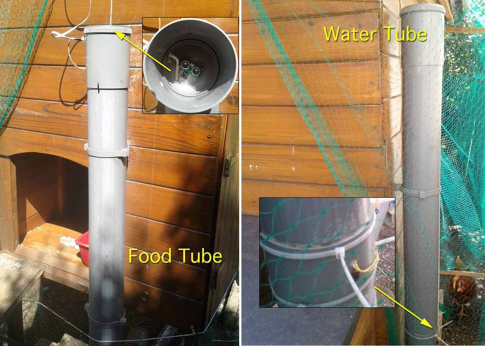

# MySensors Coop Food

This Arduino ProMini based project is a [MySensors](https://www.mysensors.org/)  node which periodically watches and reports the level of food and the level of water, in my chicken coop.

## Features
- measures food level using an ultrasonic sensor
- triggered by a float switch at the water minimum level
- works on battery

## B.O.M.
- Arduino ProMini 3.3v
- Ultrasonic Sensor US-100 (3.3v)
- DS18B20
- Float Switch
- StepUp 3.3V
- 1M ohms resistor
- 470K ohms resistor
- 4.7K ohms resistor
- 0.1uF Ceramic Capacitor

## Building Notes
- I've used the excellent [sundberg84's PCB](https://www.openhardware.io/view/4/EasyNewbie-PCB-for-MySensors)  which really eases the whole wiring.
- I'm using the US sensor in a PVC tube (that feeds the chicken's feeder). A crucial difficulty is to  set the US sensor perfectly parallel to the tube lid, so that the triggered sound will bounce only on the bottom of the tube
- Use the calibrate_us.ino sketch to adjust and calibrate the US sensor.

## Schematic

## Wiring

## Images

## License

This program is free software; you can redistribute it and/or modify it under the terms of the GNU General Public License as published by the Free Software Foundation; either version 2 of the License, or (at your option) any later version.

This program is distributed in the hope that it will be useful, but WITHOUT ANY WARRANTY; without even the implied warranty of MERCHANTABILITY or FITNESS FOR A PARTICULAR PURPOSE.  See the GNU General Public License for more details.

You should have received a copy of the GNU General Public License along with this program; if not, write to the Free Software Foundation, Inc., 51 Franklin Street, Fifth Floor, Boston, MA 02110-1301 USA.
